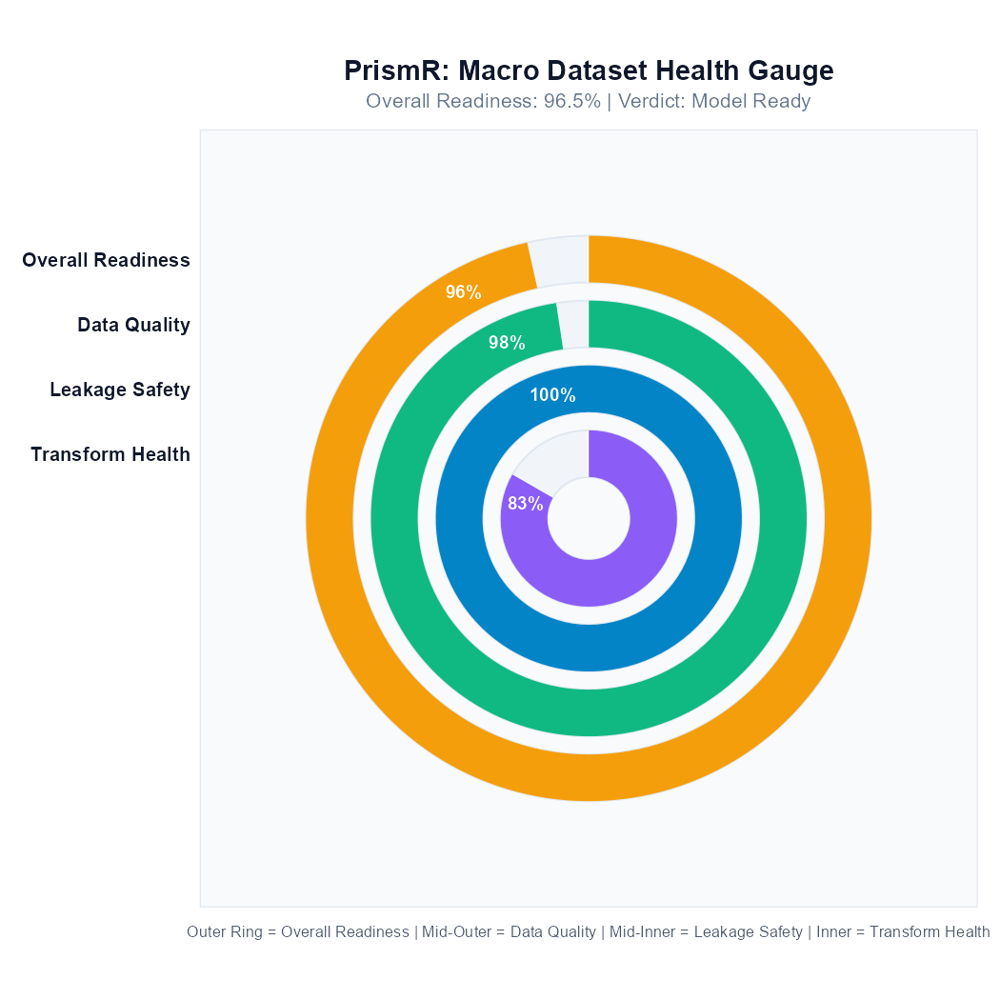
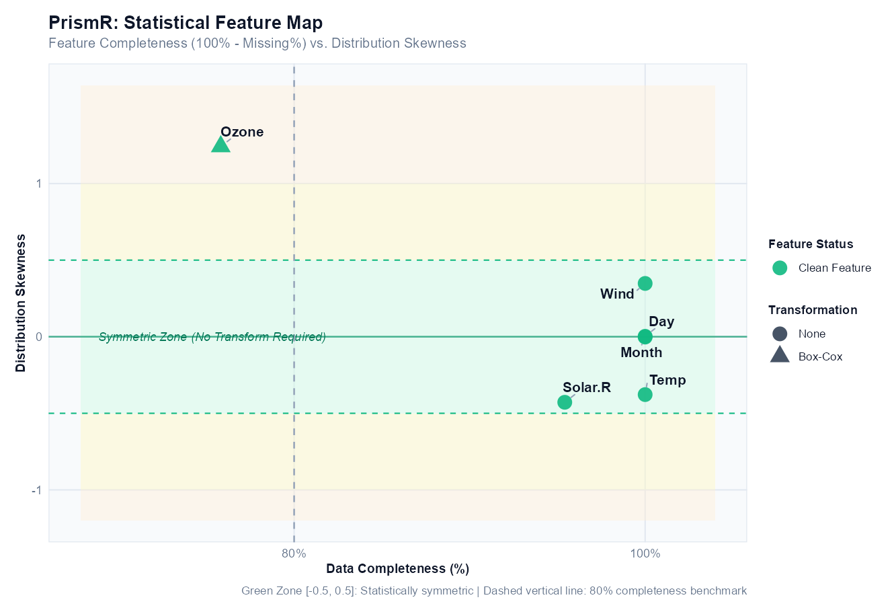
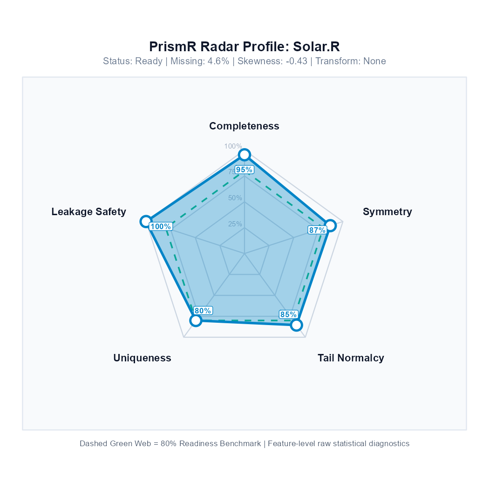

# PrismR

> **A Statistical Validation Framework for Evaluating Dataset Readiness Before Predictive Modelling.**

PrismR is an open-source R package that introduces the concept of **Model Readiness**—a structured statistical assessment of whether tabular data is truly suitable for predictive modelling before any machine learning algorithm is trained.

Rather than tuning hyperparameters on compromised data, PrismR introduces a dedicated **Statistical Validation Layer** between preprocessing and model training.

---

## Why PrismR?

In traditional machine learning pipelines, vast effort is invested in model architectures and tuning, yet data quality, leakage risks, and distributional anomalies often remain undetected until model performance degrades in production.

```text
Traditional Workflow:
Raw Data ──► Cleaning ──► Feature Engineering ──► Model Training
                              ▲
                              └── [Silent issues discovered too late]

PrismR Workflow:
Raw Data ──► Cleaning ──► ┌──────────────────────────────┐
                          │  Statistical Validation      │ ◄── PrismR
                          │  Layer (Model Readiness)     │
                          └──────────────┬───────────────┘
                                         │
                          Feature Engineering ──► Model Training
```

### The "Prism" Philosophy
A physical prism does not create new light—it separates white light into its hidden spectral components. Similarly, PrismR does not mutate or alter your dataset; it refracts tabular data to reveal latent quality deficiencies, leakage channels, and mathematical transformation requirements.

```text
                  Tabular Dataset
                         │
                         ▼
                     [ PrismR ]
                         │
       ┌─────────────────┼─────────────────┐
       ▼                 ▼                 ▼
 Data Quality    Leakage Safety    Transformation    Feature Stability
 (Missing/Dups)  (Collinear/IDs)   (Skew/Kurtosis)      (Drift/PSI)
       └─────────────────┬─────────────────┘
                         ▼
              Overall Model Readiness
```

---

## Quick Start

Run a complete Model Readiness inspection in just three lines of R:

```r
library(PrismR)

# Run full validation with an optional target column
report <- prism(airquality, target = "Ozone")
```

### High-Level Summary: `summary(report)`

```text
=========================================================
                    Prism Summary
=========================================================

Model Readiness : 96.5 
Overall Verdict : Model Ready 

Data Quality
-----------------------------------------
Data Quality Score : 97.6/100 (Excellent)

Leakage Detection
-----------------------------------------
Leakage Safety Score : 100/100 (Safe)

Transformation Analysis
-----------------------------------------
1 variable(s) require transformation.

• Ozone → Box-Cox
```

### Detailed Diagnostic Audit: `print(report)`

```text
=========================================================
                     Prism Report
=========================================================

Model Readiness : 96.5 
Overall Verdict : Model Ready 

=========================================================
Data Quality
=========================================================

Quality Score : 97.6 /100
Verdict       : Excellent 

Missing Values      : 4.79 %
Duplicate Rows      : 0 
Constant Columns    : 0 

✓ No major data quality issues detected.

=========================================================
Leakage Detection
=========================================================

Leakage Safety Score : 100 /100
Verdict              : Safe 

Identifier Columns      : 0 
Duplicate Columns       : 0 
High Cardinality        : 0 
Target Leakage          : 0 
Correlation Leakage     : 0 

✓ No potential leakage detected.

=========================================================
Transformation Analysis
=========================================================

Numeric Variables Analysed : 6 
Transformations Needed     : 1 

Variable             Finding                        Recommendation      
----------------------------------------------------------------------
Ozone                Severely right-skewed          Box-Cox             

✓ Remaining 5 variables require no transformation.
```

---

## Visual Diagnostic Suite: `plot(report)`

PrismR features a publication-ready diagnostic visualization suite built on `ggplot2`.

```r
# 1. Macro Dataset Health Gauge
plot(report, type = "radial")

# 2. Feature Diagnostic Rose
plot(report, type = "circular")

# 3. Statistical Feature Map (Completeness vs. Skewness)
plot(report, type = "bubble")

# 4. Single-Feature Spider Radar Profile
plot(report, type = "radar", feature = "Solar.R")
```

---

### 1. Macro Dataset Health Gauge (`type = "radial"`)

Tracks overall composite readiness (outer track) alongside individual sub-score progress arcs. Concentric tick marks at 25%, 50%, 75%, and 100% provide benchmark clarity.

<p align="center">
  
</p>

* **Outer Ring**: Overall Model Readiness Score (Amber).
* **Mid-Outer Ring**: Data Quality Score (Emerald).
* **Mid-Inner Ring**: Leakage Safety Score (Sky Blue).
* **Inner Ring**: Transformation Health Score (Purple).
* **Dynamic Stability**: Automatically lights up a 5th Cyan ring when `feature_stability` is evaluated.

---

### 2. Feature Diagnostic Rose (`type = "circular"`)

A Florence Nightingale coxcomb visualization mapping raw feature metrics around an open donut core.

<p align="center">
  
</p>

* **Petal Length**: True **Feature Completeness** ($100\% - \text{Missing}\%$). Columns with missing values (e.g. `Ozone` at 75.8% completeness) have visibly indented petals.
* **Petal Color**: Feature Integrity & Leakage Vector:
  * 🟩 **Clean Feature**
  * 🟦 **Identifier / High-Cardinality**
  * 🟧 **Duplicate / Constant Feature**
  * 🟪 **Unstable Distribution Drift** (auto-activated when stability is evaluated)
  * 🟥 **Target Leaker**
* **Outer Rim Cap**: Exact mathematical transformation recommended (`None`, `Log`, `Box-Cox`, `Yeo-Johnson`, `Categorical`).
* **Visual Color Swatches**: Direct graphical legend entries for immediate interpretation.

---

### 3. Statistical Feature Map (`type = "bubble"`)

Resolves feature distribution properties on a 2D coordinate plane: **Feature Completeness** on the X-axis versus **Distribution Skewness** on the Y-axis.

<p align="center">
  
</p>

* **Green Central Zone**: Marks the statistically symmetric boundary $[-0.5, 0.5]$ where no transformation is needed.
* **Warning Bands**: Highlight moderate skew ($[0.5, 1.0]$ and $[-1.0, -0.5]$) and severe skew ($> 1.0$ or $< -1.0$).
* **Point Aesthetics**: Point colors reflect leakage risk; point shapes reflect the recommended mathematical transformation.
* **Zero Collision**: Powered by `ggrepel` leader lines and deterministic micro-jittering.

---

### 4. Single-Feature Radar Profile (`type = "radar", feature = "col"`)

A spider radar chart assessing a single variable across 5 core statistical dimensions:

<p align="center">
  
</p>

1. **Completeness**: $100\% - \text{Missing}\%$
2. **Symmetry**: $100 - |\text{Skewness}| \times 30$
3. **Tail Normalcy**: $100 - |\text{Excess Kurtosis}| \times 15$
4. **Uniqueness**: Non-redundant unique value density.
5. **Leakage Safety**: Feature-level leakage penalty score.
* **Dashed Green Benchmark**: 80% readiness boundary.
* **Dynamic 6th Spoke**: Automatically expands with a **Stability** axis when `feature_stability` is evaluated.

---

## Standalone Diagnostic Functions

Each PrismR module can also be called as an independent diagnostic function:

### `quality_score(data)`
Evaluates cell missingness, duplicated rows, duplicate columns, and zero-variance constant features:

```r
q <- quality_score(airquality)

q$quality_score     # Overall score (0 - 100)
q$missing_percent   # 4.79%
q$duplicate_rows    # 0
q$variables         # Per-variable quality metrics data frame
```

### `detect_leakage(data, target = NULL)`
Identifies ID/key columns, duplicated columns, high-cardinality discrete columns, exact target leakers, and near-perfect correlation leakage ($|r| \ge 0.999$):

```r
l <- detect_leakage(my_data, target = "outcome")

l$leakage_score             # Leakage Safety Score (0 - 100)
l$identifier_columns        # e.g., "customer_id"
l$target_leakage            # Predictors identical to target
l$correlation_leakage       # Predictors with |r| >= 0.999 to target
```

### `recommend_transform(data)`
Analyzes skewness and excess kurtosis using type-2 moments (via `e1071`) and accounts for strictly positive constraints:

```r
t <- recommend_transform(airquality)

t$variables[, c("variable", "skewness", "finding", "recommendation")]
```

| Variable | Skewness | Finding | Recommendation |
|:---|:---|:---|:---|
| Ozone | 1.21 | Severely right-skewed | **Box-Cox** |
| Solar.R | -0.42 | Approximately symmetric | **None** |
| Wind | 0.34 | Approximately symmetric | **None** |
| Temp | -0.37 | Approximately symmetric | **None** |

### `feature_stability(data)`
*(Under active development)* Evaluates dataset distribution drift across time, partitions, or cross-validation folds using metrics like the Population Stability Index (PSI) and Wasserstein distance.

---

## Model Readiness Scoring Logic

PrismR computes a weighted composite **Readiness Score** ($0 - 100$):

$$\text{Readiness Score} = 0.40 \times \text{Quality} + 0.45 \times \text{Leakage} + 0.15 \times \text{Transform Health}$$

| Verdict | Score Thresholds | Action |
|:---|:---|:---|
| **Model Ready** | Score $\ge 85$ and Leakage $\ge 80$ | Proceed directly to feature engineering and modeling. |
| **Proceed with Caution** | Score $\ge 65$ and Leakage $\ge 50$ | Inspect flagged items (outliers, skewness, moderate leakage). |
| **Action Required** | Score $< 65$ or Leakage $< 50$ | Resolve severe issues (target leakers, constant features, heavy missingness). |

---

## Installation

```r
# install.packages("devtools")
devtools::install_github("Arshit-dv/PrismR")
```

### Running Unit Tests

PrismR includes a comprehensive `testthat` suite verifying all diagnostic pipelines, error guards, and plotting methods:

```r
# Run test suite
testthat::test_dir("tests/testthat")
```

---

## Design Principles

- **Statistically Justified**: Built on established statistical metrics (excess kurtosis, skewness, Pearson/Spearman correlation thresholds).
- **Inspection Without Mutation**: Never modifies or transforms your raw data in place.
- **CRAN-Compliant & Modular**: Follows R package standards, clean S3 method dispatches, and decoupled functions.
- **Automated Future-Proofing**: Visualizations automatically light up stability metrics as soon as stability analysis is activated.

---

## Authors & License

* **Author**: Arshit Choudhary ([@Arshit-dv](https://github.com/Arshit-dv))
* **License**: MIT License ([LICENSE.md](LICENSE.md))
