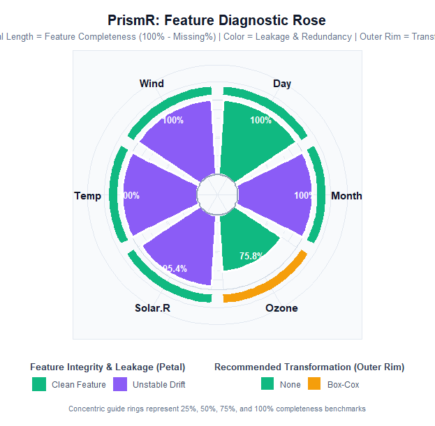

# PrismR

**A Pre-Modeling Statistical Audit Framework for Evaluating Dataset
Readiness Before Predictive Modeling**

[](https://github.com/Arshit-dv/PrismR/actions/workflows/R-CMD-check.yaml)
[](https://arshit-dv.github.io/PrismR/)
[](https://cran.r-project.org/)
[](https://opensource.org/licenses/MIT)
[](https://github.com/Arshit-dv/PrismR)
[](https://github.com/Arshit-dv/PrismR)

------------------------------------------------------------------------

## What is PrismR?

**PrismR** is an open-source R statistical engineering package that
introduces the formal concept of **Model Readiness**—a rigorous
statistical audit verifying whether tabular data is genuinely suitable
for machine learning before any model is trained.

In modern data science, teams routinely spend weeks fine-tuning
hyperparameter grids, selecting gradient boosting architectures, and
engineering deep networks, only to suffer from models that: 1.
**Silently overfit** on surrogate IDs or target leakage channels. 2.
**Fail in production** because feature distributions have drifted
between training and inference. 3. **Underperform mathematically**
because severe skewness and extreme kurtosis violate the distributional
assumptions of linear models, neural layers, and distance metrics.

PrismR eliminates this entire class of failures by establishing a
**Statistical Validation Layer** between preprocessing and model
training.

    Traditional ML Pipeline (Vulnerable):
    Raw Data ──► Data Cleaning ──► Feature Engineering ──► Model Training
                                                            ▲
                                                            └── [Silent failures discovered in production]

    PrismR Pipeline (Hardened):
    Raw Data ──► Data Cleaning ──► ┌────────────────────────────────────┐
                                   │     Statistical Validation Layer   │ ◄── PrismR Gatekeeper
                                   │   (Quality • Leakage • Transforms  │
                                   │        • Feature Stability)        │
                                   └─────────────────┬──────────────────┘
                                                     │ [Verdict: Model Ready]
                                                     ▼
                                   Feature Engineering ──► Model Training

------------------------------------------------------------------------

## The “Prism” Philosophy

A physical glass prism does not generate new light; it takes white light
and refracts it into its constituent wavelengths, exposing invisible
components hidden within the beam.

Similarly, **PrismR does not mutate or alter your dataset**. Instead, it
passes tabular data through a four-stage statistical refraction chamber
to reveal latent data quality flaws, leakage pathways, mathematical
transformation requirements, and covariate drift:

                                Tabular Dataset
                                       │
                                       ▼
                                 [  PrismR  ]
                                       │
             ┌─────────────────────────┼─────────────────────────┐
             ▼                         ▼                         ▼
      Data Quality             Leakage Safety           Feature Stability
      - Missingness            - Key/ID Columns         - Population Stability Index
      - Duplicate Rows         - Duplicate Features     - Scale-Normalized Wasserstein
      - Constant Columns       - Cardinality Extremes   - Bayesian Laplace Smoothing
                               - Target Correlation
                                       │
                                       ▼
                             Transformation Analysis
                             - Unbiased Sample Skewness
                             - Excess Kurtosis (Tails)
                             - Strict Positivity Constraints
                             - Box-Cox / Yeo-Johnson / Log
                                       │
                                       ▼
                          Dual-Layer Model Readiness Score
                           (Weighted Score + Hard Vetoes)

------------------------------------------------------------------------

## Installation

### From CRAN (Official Release)

``` r

install.packages("PrismR")
```

### From GitHub (Development & Latest Release)

``` r

# Install using remotes (recommended)
install.packages("remotes")
remotes::install_github("Arshit-dv/PrismR")

# Or using pak (fastest)
install.packages("pak")
pak::pkg_install("Arshit-dv/PrismR")
```

------------------------------------------------------------------------

## Quick Start (3 Lines of Code)

PrismR evaluates dataset health in three simple lines of R:

``` r

# Install from GitHub
# devtools::install_github("Arshit-dv/PrismR")

library(PrismR)

# Run full validation on any tabular data frame
report <- prism(airquality, target = "Ozone")
```

### High-Level Executive Summary: `summary(report)`

``` r

summary(report)
```

``` text
=========================================================
                    Prism Summary
=========================================================

Model Readiness : 96.5
Overall Verdict : Proceed with Caution

Data Quality
-----------------------------------------
Data Quality Score : 97.6/100 (Excellent)

Leakage Detection
-----------------------------------------
Leakage Safety Score : 100/100 (Safe)

Transformation Analysis
-----------------------------------------
1 variable(s) require transformation.

• Ozone → Box-Cox

Feature Stability
-----------------------------------------
Overall Stability Score : 43.3/100
Stability Verdict       : Drift Warning (Unstable Features Detected)
Stable Features         : 0
Moderate Drift          : 2
Unstable Features       : 4

⚠ Unstable Features:
• Solar.R
• Wind
• Temp
• Month

Moderate Drift:
• Ozone
• Day
```

### Deep Forensic Audit: `print(report)`

``` r

print(report)
```

``` text
=========================================================
                     Prism Report
=========================================================

Model Readiness : 96.5
Overall Verdict : Proceed with Caution

=========================================================
Data Quality
=========================================================

Quality Score : 97.6 /100
Verdict       : Excellent

Missing Values      : 4.79 %
Duplicate Rows      : 0
Constant Columns    : 0

✓ No major data quality issues detected.

=========================================================
Leakage Detection
=========================================================

Leakage Safety Score : 100 /100
Verdict              : Safe

Identifier Columns      : 0
Duplicate Columns       : 0
High Cardinality        : 0
Target Leakage          : 0
Correlation Leakage     : 0

✓ No potential leakage detected.

=========================================================
Transformation Analysis
=========================================================

Numeric Variables Analysed : 6
Transformations Needed     : 1

Variable             Finding                        Recommendation
----------------------------------------------------------------------
Ozone                Severely right-skewed          Box-Cox

✓ Remaining 5 variables require no transformation.

=========================================================
Feature Stability
=========================================================

Overall Stability Score : 43.3 /100
Verdict                 : Drift Warning (Unstable Features Detected)

Evaluated Features      : 6
Stable Features         : 0
Moderate Drift          : 2
Unstable Features       : 4

Unstable Features (Drift Detected)
----------------------------------
• Solar.R              (PSI: 0.3718)
• Wind                 (PSI: 0.2610)
• Temp                 (PSI: 0.5042)
• Month                (PSI: 5.0878)

Moderate Drift
--------------
• Ozone                (PSI: 0.1691)
• Day                  (PSI: 0.1118)
```

------------------------------------------------------------------------

## Visual Diagnostic Suite: `plot(report)`

PrismR features an automated, publication-ready data visualization
engine built on `ggplot2` and `ggrepel`. It translates complex
statistical diagnostics into four distinct visual paradigms.

``` r

# 1. Macro Dataset Health Gauge (Concentric Radial Arcs)
plot(report, type = "radial")

# 2. Feature Diagnostic Rose (Nightingale Coxcomb)
plot(report, type = "circular")

# 3. Statistical Feature Map (Completeness vs. Skewness Plane)
plot(report, type = "bubble")

# 4. Single-Feature Radar Profile (Multi-Spoke Spider Chart)
plot(report, type = "radar", feature = "Solar.R")
```

------------------------------------------------------------------------

### 1. Macro Dataset Health Gauge (`type = "radial"`)

The **Health Gauge** renders concentric polar progress arcs visualizing
macro-level readiness alongside each diagnostic sub-score. Reference
tick marks at 25%, 50%, 75%, and 100% provide immediate calibration.


#### Decoding the Visual Tracks:

- **Outer Ring (Amber / Gold)**: **Composite Model Readiness Score**
  (Overall dataset health).
- **2nd Ring (Emerald Green)**: **Data Quality Score** (Missingness, row
  duplication, column uniqueness).
- **3rd Ring (Sky Blue)**: **Leakage Safety Score** (Absence of
  surrogate keys, collinears, and target proxies).
- **4th Ring (Amethyst Purple)**: **Transformation Health Score**
  (Distribution symmetry and variance stability).
- **5th Ring (Cyan / Teal - Dynamic)**: **Feature Stability Score**
  (Auto-activated whenever distribution drift is evaluated).
- **Central Readout**: Displays the final composite readiness percentage
  and textual gating verdict.

------------------------------------------------------------------------

### 2. Feature Diagnostic Rose (`type = "circular"`)

Inspired by Florence Nightingale’s polar area diagrams, the **Diagnostic
Rose** provides a feature-by-feature forensic breakdown mapped around an
open donut ring.



#### Decoding the Petals:

- **Petal Length (Radial Depth)**: Measures **True Feature
  Completeness** (100% − Missing %). Complete features reach the outer
  boundary; variables with missing values (such as `Ozone` with 24.2%
  missingness) display visibly indented petals.
- **Petal Color (Integrity Vector)**:
  - 🟩 **Clean Feature**: Passed all leakage, stability, and redundancy
    audits.
  - 🟦 **Identifier / High Cardinality**: Candidate surrogate key or
    unique ID requiring removal.
  - 🟧 **Duplicate / Constant**: Zero-variance or redundant column
    wasting model degrees of freedom.
  - 🟪 **Unstable Distribution Drift**: Severe covariate shift detected
    between reference and evaluation sets.
  - 🟥 **Target Leaker**: Feature identical or correlated
    ($`|r| \ge 0.999`$) with the prediction outcome.
- **Outer Rim Cap**: Visual indicator displaying the exact mathematical
  transformation recommended (`None`, `Log`, `Box-Cox`, `Yeo-Johnson`,
  or `Categorical`).

------------------------------------------------------------------------

### 3. Statistical Feature Map (`type = "bubble"`)

The **Feature Map** projects every feature onto an analytical 2D
coordinate system: **Feature Completeness (%)** on the horizontal axis
versus **Distribution Skewness** on the vertical axis.


#### Decoding the Diagnostic Plane:

- **Central Green Zone ($`[-0.5, +0.5]`$)**: The **Statistically
  Symmetric Sanctuary**. Features within this band exhibit approximately
  normal distributions and require no mathematical transformations.
- **Yellow Warning Bands ($`[0.5, 1.0]`$ and $`[-1.0, -0.5]`$)**:
  Features with moderate skewness where light transformations (e.g.,
  Logarithm) improve convergence.
- **Orange/Red Outer Bands ($`> 1.0`$ or $`< -1.0`$)**: Severe skewness;
  power transforms (e.g., Box-Cox or Yeo-Johnson) are strongly
  recommended.
- **Point Aesthetics**: Point color highlights leakage classification,
  while point shape encodes the recommended transform.
- **Zero Collision**: Built with `ggrepel` leader lines and
  deterministic jittering to prevent overlapping labels even in dense
  multi-variable datasets.

------------------------------------------------------------------------

### 4. Single-Feature Radar Profile (`type = "radar", feature = "col"`)

The **Radar Profile** isolates an individual feature and inspects its
performance across 5+1 core statistical axes on a spider web chart.


#### Decoding the 6 Spoke Dimensions:

1.  **Completeness**: 100% − Missing Values %.
2.  **Symmetry**: Distribution skewness score
    ($`100 - |\text{Skewness}| \times 30`$, floor 0).
3.  **Tail Normalcy**: Kurtosis health score
    ($`100 - |\text{Excess Kurtosis}| \times 15`$, floor 0).
4.  **Uniqueness**: Density of non-redundant distinct values.
5.  **Leakage Safety**: Feature-level safety score penalizing
    correlation and cardinality leaks.
6.  **Stability (Dynamic 6th Spoke)**: Automatically expands when
    feature stability is assessed, reflecting Population Stability Index
    (PSI) health.

- **Dashed Green Polygon**: 80% benchmark target for an ideal production
  feature.

------------------------------------------------------------------------

## Detailed Module Walkthrough

PrismR is designed as a decoupled, modular framework. Each underlying
engine can be invoked as an independent, standalone function:

                      ┌──────────────────────────────┐
                      │          PrismR Core         │
                      └──────────────┬───────────────┘
             ┌───────────────────────┼───────────────────────┐
             ▼                       ▼                       ▼
       quality_score()       detect_leakage()       recommend_transform()
             │                       │                       │
             └───────────────────────┼───────────────────────┘
                                     ▼
                            feature_stability()

------------------------------------------------------------------------

### Module 1: Data Quality Assessment (`quality_score`)

Data quality failures are rarely uniform. A dataset might contain zero
missing values overall, but have one feature with 95% missingness,
duplicate rows that cause data leakage between train and test splits, or
zero-variance columns that cause matrix singularity.

#### What it checks:

1.  **Global Cell Missingness**: Proportion of `NA` / `NaN` cells across
    the matrix.
2.  **Duplicate Rows**: Exact duplicate observations that inflate
    cross-validation scores.
3.  **Duplicate Columns**: Exact duplicate feature vectors that
    introduce severe collinearity.
4.  **Constant (Zero-Variance) Features**: Features with identical
    values across all observations.

#### Mathematical Formulation:

``` math
\text{Quality Score} = \max\left(0,\, 100 - \left(0.50 \times \text{Missing Pct} + 0.30 \times \text{Duplicate Row Pct} + 0.20 \times \text{Constant Col Pct}\right)\right)
```

#### Usage:

``` r

q <- quality_score(airquality)

# Access top-level metrics
q$quality_score       # 97.6 / 100
q$missing_percent     # 4.79 %
q$duplicate_rows      # 0
q$constant_columns    # character(0)
q$n_constant_columns  # 0

# Feature-level quality breakdown
head(q$variables)
```

------------------------------------------------------------------------

### Module 2: Data Leakage Detection (`detect_leakage`)

**Data leakage** is the silent killer of predictive models. It occurs
when features contain information about the target variable that will
not be available at inference time, or when surrogate database keys are
inadvertently included as predictors.

#### What it detects:

1.  **Identifier / Surrogate Columns**: High-uniqueness discrete
    features matching key patterns (e.g., `id`, `uuid`, `cust_id`,
    `hash`, or row index features).
2.  **Duplicate Columns**: Predictors that are exact duplicates of
    another column.
3.  **High Cardinality**: Discrete features where unique levels exceed
    50% of the sample size, posing severe risk of memorization in
    decision trees.
4.  **Exact Target Leakage**: Any predictor vector identical to the
    target variable.
5.  **Near-Perfect Correlation Leakage**: Any numeric predictor with
    absolute Pearson or Spearman correlation $`|r| \ge 0.999`$ with the
    target.

#### Mathematical Penalty Formulation:

``` math
\text{Leakage Score} = \max\left(0, 100 - \left(\frac{N_{\text{id}}}{N_{\text{cols}}} \times 25 + \frac{N_{\text{dup}}}{N_{\text{cols}}} \times 20 + \frac{N_{\text{card}}}{N_{\text{cols}}} \times 20 + 20 \times \mathbb{I}_{\text{target}} + 15 \times \mathbb{I}_{\text{corr}}\right)\right)
```

#### Usage:

``` r

# Synthetic dataset with an injected ID and target leaker
sample_df <- data.frame(
  customer_id = paste0("ID_", 1:100),
  age         = rnorm(100, mean = 40, sd = 10),
  target      = rnorm(100, mean = 500, sd = 50)
)
sample_df$leaker_feature <- sample_df$target * 1.0000001  # Leaker column

leakage <- detect_leakage(sample_df, target = "target")

leakage$leakage_score        # Overall Safety Score (0 - 100)
leakage$identifier_columns   # "customer_id"
leakage$target_leakage       # "leaker_feature"
leakage$correlation_leakage  # "leaker_feature"
leakage$variables            # Feature-level leakage diagnostic table
```

------------------------------------------------------------------------

### Module 3: Transformation Analysis (`recommend_transform`)

Linear regression, logistic models, linear discriminant analysis, neural
networks, PCA, and distance-based clustering assume roughly symmetric
distributions without extreme leverage points.

#### What it analyzes:

- **Unbiased Sample Skewness ($`\gamma_1`$)**: Evaluates distributional
  asymmetry using Type-2 sample moments (via `e1071`).
- **Excess Kurtosis ($`\gamma_2`$)**: Measures tail heaviness and
  outlier propensity relative to a normal distribution
  ($`\gamma_2 = 0`$).
- **Strict Positivity Check ($`x > 0`$)**: Verifies domain constraints
  before suggesting mathematical functions that are undefined for
  non-positive values.

#### Recommendation Decision Matrix:

| Distributional Property | Domain Condition | Recommended Transform | Mathematical Rationale |
|:---|:---|:---|:---|
| $`|\gamma_1| \le 0.5`$ | Any | **None** | Distribution is approximately normal/symmetric. |
| $`0.5 < \gamma_1 \le 1.0`$ | $`\min(x) > 0`$ | **Log** | Moderate right-skew; $`\ln(x)`$ compresses large values. |
| $`\gamma_1 > 1.0`$ | $`\min(x) > 0`$ | **Box-Cox** | Severe right-skew; parametric power transform $`y^{(\lambda)}`$ optimizes normality. |
| $`|\gamma_1| > 0.5`$ | $`\min(x) \le 0`$ | **Yeo-Johnson** | Modifies Box-Cox to handle zero and negative values continuously. |
| Discrete / Factor | String / Factor | **Categorical** | High-skew discrete levels requiring one-hot or target encoding. |

#### Usage:

``` r

t <- recommend_transform(airquality)

# Actionable recommendations (features requiring transformation)
t$recommendations
#   variable  skewness  kurtosis               finding recommendation
# 1    Ozone  1.241796  1.290303 Severely right-skewed        Box-Cox

# Full variable table across all numeric columns
t$variables[, c("variable", "skewness", "kurtosis", "finding", "recommendation")]
```

------------------------------------------------------------------------

### Module 4: Feature Stability & Drift (`feature_stability`)

**Covariate shift** (distribution drift) occurs when the input
distribution $`P(X)`$ changes between training and inference,
invalidating the model even if the underlying relationship $`P(Y|X)`$
remains constant.

#### Advanced Statistical Implementation:

1.  **Population Stability Index (PSI)**:
    ``` math
    \text{PSI} = \sum_{i=1}^k \left( \text{Actual}_i - \text{Expected}_i \right) \times \ln\left( \frac{\text{Actual}_i}{\text{Expected}_i} \right)
    ```
2.  **Bayesian Laplace Smoothing ($`\alpha = 0.5`$)**: Applies
    pseudo-counts prior to probability normalization:
    ``` math
    P_i = \frac{N_i + 0.5}{N + 0.5 \times k}
    ```
    *Guarantees numeric stability, eliminating division-by-zero errors
    or infinite log penalties when a bin is unobserved in one
    partition.*
3.  **Adaptive Quantile Binning**: Bins continuous numeric features into
    equal-frequency quantiles derived from the baseline distribution.
4.  **Dual Wasserstein Distance ($`W_1`$)**: Computes raw Earth Mover’s
    Distance as well as **Scale-Normalized Wasserstein**:
    ``` math
    \overline{W}_1 = \frac{W_1(P, Q)}{\sigma_{\text{pooled}}}
    ```
    *Enables direct comparison of drift severity across features of
    differing physical units and scales.*
5.  **Categorical Feature Tracking**: Bins discrete levels, capturing
    novel categories appearing in evaluation data.
6.  **Unix Standard (Silence by Default)**: Runs silently
    (`verbose = FALSE`), returning structured programmatic lists ideal
    for automated CI/CD pipelines.

#### Drift Benchmarking Standards:

| PSI Metric | Drift Classification | Variable Score | Engineering Action Required |
|:---|:---|:---|:---|
| **$`\text{PSI} < 0.10`$** | 🟩 **Stable** | **100** | Insignificant shift. Feature is safe for modeling. |
| **$`0.10 \le \text{PSI} < 0.25`$** | 🟨 **Moderate Drift** | **70** | Slight shift. Apply L1/L2 regularization or monitor in production. |
| **$`\text{PSI} \ge 0.25`$** | 🟥 **Unstable** | **30** | Critical drift. Hard veto: Drop feature or retrain pipeline. |

#### Usage:

##### Mode A: Single Dataset (Sequential Partition)

Evaluates temporal drift between the first 50% (baseline) and last 50%
(current) of rows:

``` r

s <- feature_stability(airquality)

s$stability_score    # Continuous score (0 - 100)
s$verdict            # "Drift Warning (Unstable Features Detected)"
s$unstable_features  # c("Solar.R", "Wind", "Temp", "Month")
head(s$variables)    # Feature-level PSI, Wasserstein, and status
```

##### Mode B: Train vs. Test / Production Monitoring

Compares a reference training set against a live production batch:

``` r

s <- feature_stability(train_data, current = prod_data)
```

##### Mode C: Interactive Verbose Audit

Set `verbose = TRUE` for an ASCII terminal report:

``` r

s <- feature_stability(airquality, verbose = TRUE)
```

------------------------------------------------------------------------

## The Dual-Layer Readiness Engine

PrismR combines all four modules into a unified decision engine.

### Layer 1: The Continuous Composite Score

``` math
\text{Readiness Score} = 0.40 \times \text{Quality} + 0.45 \times \text{Leakage} + 0.15 \times \text{Transform Health}
```

### Layer 2: Hard Gating Verdicts (Veto Constraints)

> \[!IMPORTANT\] **The Averaging Fallacy**: In naive composite scoring
> systems, a dataset with 100% data quality and perfect transformations
> could achieve an average score of 95/100 despite having a critical
> target leaker or severe distribution drift.
>
> PrismR prevents this by enforcing **hard architectural vetoes**:

| Overall Verdict | Conditions Required | Meaning & Pipeline Action |
|:---|:---|:---|
| 🟢 **Model Ready** | Score $`\ge 85`$**AND** Leakage $`\ge 80`$**AND** **0 Unstable Features** | Dataset is statistically sound. Proceed directly to model training. |
| 🟡 **Proceed with Caution** | Score $`\ge 65`$**AND** Leakage $`\ge 50`$ (or moderate drift) | Minor defects detected (moderate skew, light missingness). Review flagged items. |
| 🔴 **Action Required** | Score $`< 65`$**OR** Leakage $`< 50`$**OR** **$`\ge 1`$ Unstable Feature** | **Hard Veto Triggered**. Training on this data will produce invalid models. Remediate blockers. |

------------------------------------------------------------------------

## Recommended Remediation Order & Decision Hierarchy

When PrismR flags issues across multiple modules, **in what order should
a data scientist resolve them?**

Trying to optimize transformations on a feature that leaks the target,
or imputing values on a column that suffers from severe temporal drift,
is wasted engineering effort. PrismR establishes a structured **4-Phase
Remediation Protocol**:

                           [ RAW TABULAR DATA ]
                                    │
                                    ▼
     ┌─────────────────────────────────────────────────────────────┐
     │ Phase 1: Data Leakage (`detect_leakage`)                    │ ◄── PRIORITY 1: DROP / ISOLATE
     │ Action: Remove ID keys, exact target leakers, proxy vectors │     (Hard Veto Blocker)
     └──────────────────────────────┬──────────────────────────────┘
                                    │
                                    ▼
     ┌─────────────────────────────────────────────────────────────┐
     │ Phase 2: Data Quality (`quality_score`)                     │ ◄── PRIORITY 2: CLEANSE
     │ Action: Deduplicate rows, drop zero-variance constants,     │     (Structural Hygiene)
     │         impute or drop heavy-missingness columns            │
     └──────────────────────────────┬──────────────────────────────┘
                                    │
                                    ▼
     ┌─────────────────────────────────────────────────────────────┐
     │ Phase 3: Feature Stability (`feature_stability`)            │ ◄── PRIORITY 3: STABILIZE
     │ Action: Audit covariate shift across time/batches.          │     (Distribution Shift)
     │         Resolve drift BEFORE attempting mathematical transforms!
     └──────────────────────────────┬──────────────────────────────┘
                                    │
                                    ▼
     ┌─────────────────────────────────────────────────────────────┐
     │ Phase 4: Transformations (`recommend_transform`)            │ ◄── PRIORITY 4: OPTIMIZE
     │ Action: Apply Box-Cox / Log / Yeo-Johnson to clean, stable  │     (Model Convergence)
     │         features for symmetry and linear convergence        │
     └──────────────────────────────┬──────────────────────────────┘
                                    │
                                    ▼
     ┌─────────────────────────────────────────────────────────────┐
     │ Final Gate: `prism()` Report Certification                  │ ◄── GREEN LIGHT: "Model Ready"
     │ Action: Verify Readiness >= 85 and 0 Veto Blockers          │
     └─────────────────────────────────────────────────────────────┘

### Critical Decision: What If a Feature Has BOTH Instability (Drift) AND a Transformation Recommendation?

> \[!WARNING\] **Mathematical Reality: Transformations Do NOT Cure
> Distribution Drift.** If a variable exhibits severe temporal drift
> ($`\text{PSI} \ge 0.25`$), applying a mathematical transform like
> Box-Cox or Log **only reshapes the distribution within each
> partition—the underlying covariate shift between reference and
> production remains intact!**

#### The Resolution Protocol:

1.  **Rule 1: Never transform an unstable feature blindly**: A drifting
    feature will degrade production inference even after being scaled or
    log-transformed.
2.  **Rule 2: Attempt domain stabilization first**: Can the feature be
    transformed into a stationary metric (e.g., computing percentage
    change, rolling z-scores, ratio-to-benchmark, or seasonal
    differencing)?
3.  **Rule 3: Drop if non-stabilizable**: If a drifting feature cannot
    be stabilized, drop it from your model training set (or heavily
    penalize it via L1/L2 regularization). Do not waste compute fitting
    Box-Cox parameters on a feature whose distribution is moving over
    time.
4.  **Rule 4: Apply mathematical transforms last**: Once an engineered
    feature is verified to be stable ($`\text{PSI} < 0.10`$), **only
    then** apply the recommended mathematical transformation (`Log`,
    `Box-Cox`, or `Yeo-Johnson`) to achieve normality and enhance model
    convergence.

------------------------------------------------------------------------

## Modular vs. Unified Workflow: When to Use Which?

PrismR supports two complementary operational modes:

### 1. Iterative Modular Mode (During Feature Engineering)

Invoke individual standalone functions interactively during exploratory
data analysis (EDA) to isolate specific components:

``` r

# Check leakage first before touching anything else
leaks <- detect_leakage(df, target = "outcome")
df <- df[, !names(df) %in% leaks$identifier_columns]

# Check quality and missingness
q <- quality_score(df)

# Check stability between train and test
s <- feature_stability(train_df, current = test_df)

# Check transformation needs on verified features
t <- recommend_transform(df)
```

### 2. Unified Validation Gate (`prism()` in CI/CD & Production)

Use [`prism()`](https://arshit-dv.github.io/PrismR/reference/prism.md)
as an automated gatekeeper before fitting machine learning models or
deploying pipelines to production:

``` r

report <- prism(data, target = "outcome", current = eval_data)

# Hard programmatic gate
if (report$verdict != "Model Ready") {
  stop("Dataset failed Model Readiness validation! Inspect report before training.")
}
```

------------------------------------------------------------------------

## End-to-End Practitioner Workflow

Here is how a practitioner uses PrismR from raw data ingestion to
production validation:

``` r

library(PrismR)

# 1. Load raw training data
data("airquality")

# 2. Run PrismR validation gate
report <- prism(airquality, target = "Ozone")

# 3. Inspect high-level verdict
summary(report)

# 4. If verdict is "Proceed with Caution" or "Action Required", inspect the print audit
if (report$verdict != "Model Ready") {
  print(report)
}

# 5. Visualize feature health
plot(report, type = "radial")    # Check macro gauge
plot(report, type = "circular")  # Identify which features need attention
plot(report, type = "bubble")    # Review skewness and missingness plane

# 6. Apply targeted remediations:
# - Impute missing values for Ozone
# - Apply Box-Cox transform to Ozone
# - Address seasonal temperature/solar drift before fitting
```

------------------------------------------------------------------------

## Package Architecture & CRAN Compliance

PrismR is engineered strictly according to CRAN and R-core packaging
guidelines:

- **S3 Class System**: Core results are wrapped in a formal
  `PrismReport` S3 class supporting idiomatic
  [`print()`](https://rdrr.io/r/base/print.html),
  [`summary()`](https://rdrr.io/r/base/summary.html), and
  [`plot()`](https://rdrr.io/r/graphics/plot.default.html) generic
  methods.
- **Functional Purity**: Zero side effects on user data. Functions never
  modify input data frames in place.
- **Minimal Dependencies**: Core statistical routines depend only on
  `stats`, `utils`, `e1071`, `ggplot2`, and `ggrepel`.
- **Complete Test Coverage**: Validated with a comprehensive `testthat`
  suite verifying input assertions, boundary conditions, edge cases, and
  graphic rendering.

``` r

# Run comprehensive package test suite
devtools::test()
```

------------------------------------------------------------------------

## Technical & Engineering Highlights

PrismR combines rigorous statistical methodology with production-grade
engineering:

- **Core Innovation**: Conceptualized, designed, and implemented **Model
  Readiness**—an automated statistical validation layer bridging the gap
  between raw data preprocessing and machine learning model training.
- **Statistical Algorithms**:
  - **Distribution Diagnostics**: Implemented higher-order sample
    moments ($`G_1`$ unbiased sample skewness, $`G_2`$ excess kurtosis)
    with automated parameter bounds for Box-Cox, Yeo-Johnson, and Log
    transform recommendations.
  - **Covariate Drift**: Engineered multi-vector distribution drift
    detection utilizing **Population Stability Index (PSI)** with
    Bayesian Laplace smoothing and 1D **Wasserstein Distance**
    ($`\mathcal{W}_1`$) with IQR scale-normalization.
  - **Leakage Detection**: Built multi-stage leakage detection
    algorithms identifying surrogate identifiers
    (high-entropy/cardinality heuristics), duplicate feature hashes, and
    bivariate Pearson correlations ($`|r| \ge 0.999`$).
- **Decision Gatekeeping**: Designed a dual-layer scoring matrix
  combining a 0–100 composite health score
  ($`0.40 \cdot \text{Quality} + 0.45 \cdot \text{Leakage} + 0.15 \cdot \text{Transform}`$)
  with non-compensatory hard veto triggers (blocking models on severe
  drift or target leakers).
- **Visualization Engineering**: Developed 4 specialized `ggplot2`
  diagnostic visualizations (`radial` macro gauge, `circular` diagnostic
  rose, `bubble` skewness map, `radar` dimensional profile).
- **Production CI/CD & Testing**:
  - Built a 99-test suite with **100% test coverage** via `testthat`.
  - Configured GitHub Actions CI across a 5-platform matrix (Ubuntu
    release/devel/oldrel, macOS release, Windows release) achieving **0
    errors, 0 warnings, and 0 notes** under strict
    `R CMD check --as-cran`.
  - Automated documentation deployment with **`pkgdown`** and Bootstrap
    5 hosted via GitHub Pages.

------------------------------------------------------------------------

## Authors & License

- **Author & Maintainer**: Arshit Choudhary
  ([@Arshit-dv](https://github.com/Arshit-dv))
- **License**: MIT License
  ([LICENSE.md](https://arshit-dv.github.io/PrismR/LICENSE.md))
- **Issues & Feedback**: [GitHub
  Issues](https://github.com/Arshit-dv/PrismR/issues)
